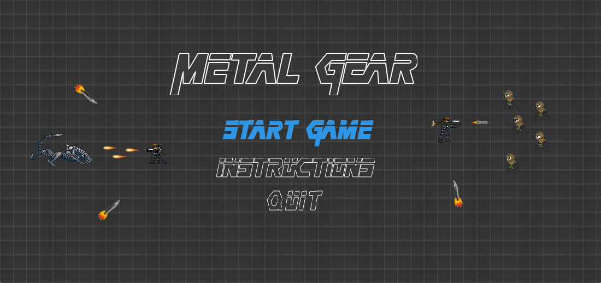
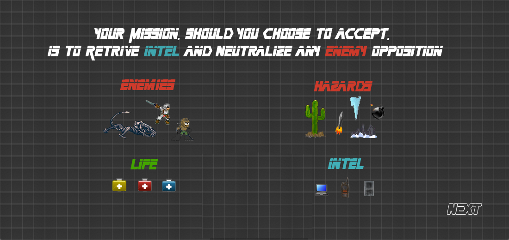
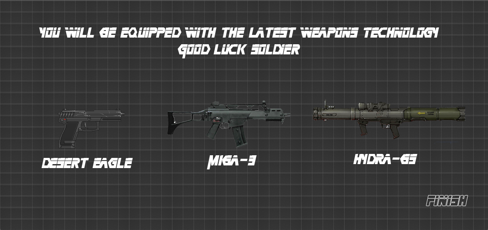
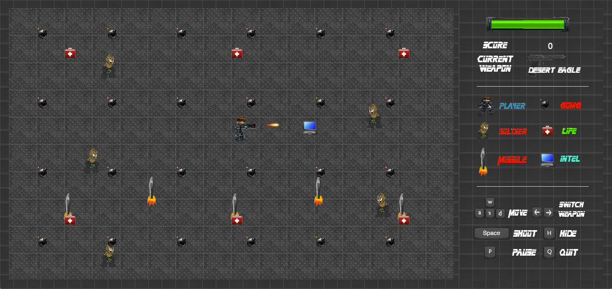
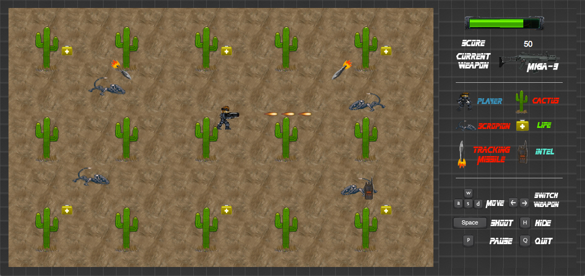
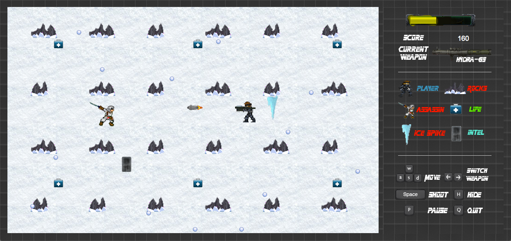

Developed in my Sophomore Year at USC, Metal Gear is a multilevel 2D shooter game based off one my favorite childhood games: Metal Gear Solid.

From the hazardous environment of the Kalahari desert to the sub zero climate of the Alps, Snake embarks on a highly dangerous mission to gather Intel and neutralize any terrorist threat.

testafewf